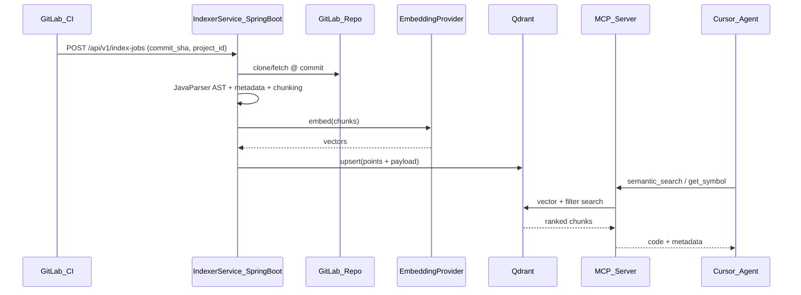
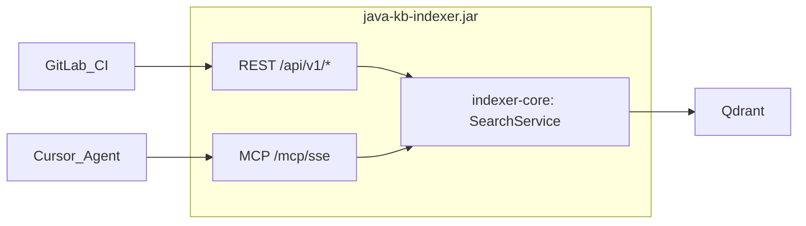

---

name: Java KB Indexer Service

overview: Spring Boot-сервис для AST-парсинга Java-кода, запускаемый из GitLab CI при push в default branch, с индексацией чанков и метаданных в Qdrant (OpenAI-compatible embeddings) и доступом агента через встроенный MCP.

todos:

  - id: infra-setup

    content: "Поднять docker-compose: PostgreSQL + Qdrant + java-kb-indexer"

    status: pending

  - id: scaffold-project

    content: "Создать Spring Boot проект в D:\\projects\\java-kb-indexer (api + core + mcp модули)"

    status: pending

  - id: javaparser-pipeline

    content: "Реализовать JavaParser visitor: class/method metadata + AST chunking"

    status: pending

  - id: qdrant-embedding

    content: "Spring AI starters: model-openai (embeddings) + vector-store-qdrant + Document metadata"

    status: pending

  - id: index-jobs-api

    content: REST API POST /index-jobs + async обработка + JGit checkout

    status: pending

  - id: gitlab-ci-template

    content: Шаблон .gitlab-ci.yml и group-level CI variables

    status: pending

  - id: mcp-server

    content: "Встроить MCP tools в индексер (SSE /mcp/sse), общий SearchService с REST"

    status: pending

isProject: false

---

# Векторная база знаний Java-кода: сервис + GitLab CI + Qdrant + MCP

## Контекст окружения (по результатам [исследования](e47e6f81-8c55-4aa7-97d8-ffea6bf4ffab))

- **Greenfield:** готового проекта Java KB / Qdrant / MCP нет — только этот план

- **Путь проекта:** `D:\projects\java-kb-indexer` (основная папка проектов — `D:\projects\`)

- **Инфраструктура:** Qdrant и Open WebUI сейчас **не запущены** — первый шаг Phase 1

- **MCP в Cursor:** `C:\Users\yaroslav\.cursor\mcp.json` **не существует** — создать при подключении `indexer-mcp`

- **Образец Spring-структуры:** [D:\projects\nalog-parser-java](D:\projects\nalog-parser-java) (REST, security, GitLab-паттерны; логику парсинга не переиспользовать)

## Целевая архитектура



## 1. Сервис индексации (Spring Boot)

Репозиторий: `D:\projects\java-kb-indexer` → отдельный GitLab repo в org.

### Модули

| Модуль         | Назначение                                         |

| -------------- | -------------------------------------------------- |

| `indexer-api`  | REST: приём задач, статус job, health + **MCP endpoint (встроен)** |

| `indexer-core` | Git checkout, парсинг, chunking, embedding, Qdrant, **SearchService** (общий для REST и MCP) |

| `indexer-mcp`  | MCP tool handlers — **код-модуль**, не отдельное приложение |

### API для GitLab CI

```

POST /api/v1/index-jobs

Authorization: Bearer <INDEXER_TOKEN>

{

  "gitlab_project_id": "123",

  "repo_path": "group/backend-service",   // namespace для Qdrant filter

  "repo_url": "[https://gitlab.example.com/group/backend-service.git](https://gitlab.example.com/group/backend-service.git)",

  "commit_sha": "abc123...",

  "branch": "master"

}

```

Ответ `202 Accepted` + `job_id`. Обработка асинхронная `@Async` + таблица jobs в **PostgreSQL**).

### PostgreSQL — операционные данные

Векторы хранятся в Qdrant; PostgreSQL — для job state и метаданных индексации:

| Таблица | Назначение |

|---------|------------|

| `index_jobs` | id, repo_path, commit_sha, status (PENDING/RUNNING/DONE/FAILED), error, started_at, finished_at |

| `indexed_repos` | repo_path, latest_commit_sha, last_indexed_at |

Миграции: **Liquibase** `src/main/resources/db/changelog/`).

```yaml

spring:

  datasource:

    url: ${DATABASE_URL:jdbc:postgresql://localhost:5432/java_kb}

    username: ${DATABASE_USER:java_kb}

    password: ${DATABASE_PASSWORD}

  jpa:

    hibernate:

      ddl-auto: validate

  liquibase:

    change-log: classpath:db/changelog/db.changelog-master.yaml

```

**Идемпотентность:** ключ `(repo_path, commit_sha)` — повторный push не дублирует точки.

**Инкрементальность (v2):** SHA-256 хеш файла → пропуск неизменённых; на первом этапе — полная переиндексация коммита (проще и надёжнее для master).

---

## 2. Как парсить Java: JavaParser + visitor

**Библиотека:** [JavaParser]([https://github.com/javaparser/javaparser](https://github.com/javaparser/javaparser)) — зрелый AST, хорошо подходит для Spring Boot стека.

### Единица индексации (чанк)

Границы по AST, не по строкам (подход cAST / JCodeIndexer):

| Приоритет | Граница                         | Когда                                                         |

| --------- | ------------------------------- | ------------------------------------------------------------- |

| 1         | **Method**                      | основной чанк (90% случаев)                                   |

| 2         | **Class/Interface/Enum/Record** | если класс маленький или метод < N строк                      |

| 3         | **Field**                 | отдельные чанки для `@Entity` полей, важных полей с аннотациями |

| 4         | **Split больших методов**       | если тело > ~1500 токенов — разбить по `BlockStmt` / `IfStmt` |

Каждый чанк несёт **контекст родителя** в текст для embedding (package, class, annotations), но хранит **собственный** `symbol_type` и `qualified_name`.

### Visitor-пайплайн

```java

// Псевдокод обхода

CompilationUnit cu = StaticJavaParser.parse(file);

cu.findAll(ClassOrInterfaceDeclaration.class).forEach(cls -> {

    extractClassMetadata(cls);          // stereotype, extends, implements

    cls.findAll(MethodDeclaration.class).forEach(method -> {

        extractMethodMetadata(method);  // signature, annotations, calls

        buildChunk(cls, method);        // source slice + metadata map

    });

});

```

Дополнительно извлекать:

- **Call graph (best-effort):** `MethodCallExpr` внутри метода → `calls[]` в payload

- **Injection graph:** типы полей/параметров конструктора с `@Autowired` → `injects[]`

- **HTTP mapping:** `@GetMapping`, `@PostMapping` → `http_method`, `http_path`

- **Spring stereotype:** `@Service` → `stereotype: "service"`

- **Javadoc** первой строки → `summary`

### Схема метаданных (Qdrant payload)

```json

{

  "point_id": "group/backend:abc123:com.example.UserService.findById",

  "repo_path": "group/backend-service",

  "gitlab_project_id": "123",

  "commit_sha": "abc123",

  "branch": "master",

  "file_path": "src/main/java/com/example/[UserService.java](http://UserService.java)",

  "package": "com.example",

  "qualified_name": "com.example.UserService.findById",

  "symbol_type": "method",

  "name": "findById",

  "signature": "findById(Long id): Optional<UserDto>",

  "modifiers": ["public"],

  "annotations": ["@Transactional"],

  "stereotype": "service",

  "http_method": null,

  "http_path": null,

  "extends": null,

  "implements": [],

  "calls": ["userRepository.findById", "userMapper.toDto"],

  "injects": ["UserRepository", "UserMapper"],

  "javadoc_summary": "Find user by id",

  "line_start": 42,

  "line_end": 58,

  "content_hash": "sha256:...",

  "indexed_at": "2026-09-02T09:00:00Z",

  "language": "java"

}

```

**Qdrant collection:** одна общая `java_kb` для org-wide. Фильтрация по `repo_path`, `symbol_type`, `stereotype`, `annotations` через payload indexes.

**Удаление старых версий (retention):** при каждом push — **полная переиндексация коммита** (Phase 1):

1. `DELETE` из Qdrant все точки с `repo_path = X` (старый snapshot)

2. Парсинг всего `src/main/java` нового коммита

3. `UPSERT` всех чанков с новым `commit_sha`

В Qdrant всегда актуальное состояние default branch — история коммитов не хранится.

**Инкрементальность (Phase 3):** индексировать только изменённые файлы (по SHA-256). Для каждого изменённого файла — удалить его старые точки `file_path` filter) и upsert новые. Удалённые файлы — delete по `file_path`. Неизменённые — пропуск.

---

## 3. Текст для embedding (важно для качества RAG)

Не эмбеддить «голый» код. Формат:

```

Repository: group/backend-service

Package: com.example.service

QualifiedName: com.example.UserService.findById

Type: method | Stereotype: @Service

Signature: findById(Long id): Optional<UserDto>

Annotations: @Transactional(readOnly=true)

Calls: UserRepository.findById, UserMapper.toDto

Summary: Find user by id and map to DTO

---

<исходный Java-код метода + сигнатура класса>

```

Натуральный язык + структура улучшают retrieval для вопросов вроде «где обрабатывается создание заказа?».

---

## 4. GitLab CI интеграция (org-wide, self-hosted)

**GitLab:** self-hosted `GITLAB_URL` в env индексера). Clone через JGit + Deploy Token / Group Access Token с `read_repository`.

**Ветка:** настраиваемая — default branch per-repo `$CI_DEFAULT_BRANCH`) или явный env `JAVA_KB_INDEX_BRANCH`.

### Вариант A — job в каждом репозитории (рекомендуется для старта)

Шаблон `.gitlab-ci.yml` (вынести в [GitLab CI/CD Catalog]([https://docs.gitlab.com/ee/ci/components/](https://docs.gitlab.com/ee/ci/components/)) или include-файл в group):

```yaml

index:knowledge-base:

  stage: .post

  rules:

    - if: '$CI_COMMIT_BRANCH == $CI_DEFAULT_BRANCH'

  script:

    - |

      curl --fail-with-body -X POST "${JAVA_KB_INDEXER_URL}/api/v1/index-jobs" \

        -H "Authorization: Bearer ${JAVA_KB_INDEXER_TOKEN}" \

        -H "Content-Type: application/json" \

        -d "{

          \"gitlab_project_id\": \"${CI_PROJECT_ID}\",

          \"repo_path\": \"${CI_PROJECT_PATH}\",

          \"repo_url\": \"${CI_REPOSITORY_URL}\",

          \"commit_sha\": \"${CI_COMMIT_SHA}\",

          \"branch\": \"${CI_COMMIT_REF_NAME}\"

        }"

```

CI/CD variables на уровне **Group**: `JAVA_KB_INDEXER_URL`, `JAVA_KB_INDEXER_TOKEN`.

Deploy token / CI job token с read_repository для clone на стороне сервиса.

### Вариант B — Group System Hook (позже)

Один webhook на всю организацию → сервис сам фильтрует `push` на `master`. Меньше дублирования в `.gitlab-ci.yml`, но сложнее отладка.

---

## 5. AI-интеграция: Spring AI starters + Qdrant

Все AI-вызовы — через **Spring AI starters** (OpenAI-compatible провайдер, Qdrant vector store, MCP server). Ручные клиенты `openai-java`, `io.qdrant:client`) не используем — только auto-configuration.

```yaml

spring:

  ai:

    openai:

      api-key: ${OPENAI_API_KEY}

      base-url: ${OPENAI_BASE_URL}              # OpenAI-compatible endpoint

      embedding:

        options:

          model: ${EMBEDDING_MODEL:text-embedding-3-small}

          dimensions: ${EMBEDDING_DIMS:1536}

    vectorstore:

      qdrant:

        host: ${QDRANT_HOST:[localhost](http://localhost)}

        port: ${QDRANT_PORT:6334}

        collection-name: java_kb

        initialize-schema: true

indexer:

  embedding:

    batch-size: ${EMBEDDING_BATCH_SIZE:50}

```

**Использование в коде:**

```java

@Service

@RequiredArgsConstructor

class IndexingService {

    private final EmbeddingModel embeddingModel;   // из spring-ai-starter-model-openai

    private final VectorStore vectorStore;         // из spring-ai-starter-vector-store-qdrant

    void index(List<Document> chunks) {

        vectorStore.add(chunks);  // embed + upsert в Qdrant

    }

}

```

**Правила:**

- `model` и `dimensions` — конфигурируемые через `spring.ai.openai.embedding.options.*`

- При смене `dimensions` — пересоздать Qdrant collection `java_kb`

- При смене `model` — полный reindex

- Batch size — свой property `indexer.embedding.batch-size` (Spring AI embed по одному/батчу через обёртку)

Docker Compose:

```yaml

services:

  postgres:

    image: postgres:16

    environment:

      POSTGRES_DB: java_kb

      POSTGRES_USER: java_kb

      POSTGRES_PASSWORD: ${DATABASE_PASSWORD}

    ports: ["5432:5432"]

    volumes: ["pgdata:/var/lib/postgresql/data"]

  qdrant:

    image: qdrant/qdrant:latest

    ports: ["6333:6333", "6334:6334"]

  java-kb-indexer:

    build: .

    depends_on: [postgres, qdrant]

    environment:

      DATABASE_URL: jdbc:postgresql://postgres:5432/java_kb

      DATABASE_USER: java_kb

      DATABASE_PASSWORD: ${DATABASE_PASSWORD}

      QDRANT_HOST: qdrant

      OPENAI_API_KEY: ${OPENAI_API_KEY}

      OPENAI_BASE_URL: ${OPENAI_BASE_URL}

      EMBEDDING_MODEL: ${EMBEDDING_MODEL:-text-embedding-3-small}

      EMBEDDING_DIMS: ${EMBEDDING_DIMS:-1536}

      EMBEDDING_BATCH_SIZE: ${EMBEDDING_BATCH_SIZE:-50}

      GITLAB_URL: ${GITLAB_URL}

      GITLAB_TOKEN: ${GITLAB_TOKEN}

volumes:

  pgdata:

```

---

## 6. MCP — встроен в индексер (не отдельное приложение)

На первых этапах MCP — это **пакет внутри того же Spring Boot-приложения**, а не отдельный локальный сервис. REST API и MCP используют общий `SearchService` / `QdrantClient` из `indexer-core`.

### Режимы запуска (один jar, один docker-контейнер)



| Режим | Как | Когда |

|-------|-----|-------|

| **SSE (рекомендуется для Phase 1)** | MCP endpoint на том же `:8080`, например `/mcp/sse` | Один процесс: Docker + Cursor подключается по URL |

| **stdio (опционально позже)** | Тот же jar с `--spring.profiles.active=mcp-stdio` | Если нужен spawn-процесс Cursor без HTTP |

**Phase 1 — только SSE:** не поднимаем второй процесс, не собираем отдельный jar. Cursor в `mcp.json` указывает URL работающего индексера.

### Tools

| Tool                 | Описание                                                                 |

| -------------------- | ------------------------------------------------------------------------ |

| `semantic_search`    | query + optional `repo_path`, `symbol_type`, `stereotype`                |

| `get_symbol`         | точный поиск по `qualified_name`                                         |

| `list_repos`         | список проиндексированных репозиториев                                   |

| `find_by_annotation` | например все `@RestController`                                           |

| `get_callers`        | из payload `calls` (v1: обратный поиск по filter; v2: граф в PostgreSQL) |

MCP transport: **SSE** (встроен в индексер, Phase 1). Конфиг в `C:\Users\yaroslav\.cursor\mcp.json`:

```json

{

  "mcpServers": {

    "java-kb": {

      "url": "[http://localhost:8080/mcp/sse](http://localhost:8080/mcp/sse)"

    }

  }

}

```

Реализация: `spring-ai-starter-mcp-server-webmvc` — `@McpTool` методы в `indexer-mcp` делегируют в `SearchService`, который использует `VectorStore` (Spring AI Qdrant starter).

> **Позже (Phase 2+):** при необходимости добавить profile `mcp-stdio` для запуска тем же jar без HTTP-сервера — но на старте это не нужно.

---

## 7. Scope индексации: только Java-код

Конфиги `application.yml`, `.properties`, Spring XML) **не хранятся в репозиториях** — индексируем исключительно исходный код.

**Включать:**

- `**/src/main/java/**/*.java` — все модули Maven/Gradle multi-module проекта

**Исключать:**

- `src/test/**` — тесты

- `target/`, `build/`, `out/` — артефакты сборки

- `**/generated/**` — сгенерированный код (MapStruct, protobuf и т.п.)

- Любые не`.java` файлы

**Отложить (не в scope):**

- Kotlin `.kt`)

- Конфиги, ресурсы, SQL-миграции

- Полный inter-procedural call graph — начать с in-method `MethodCallExpr`

- LLM-generated knowledge graph

---

## 8. Структура проекта

```

java-kb-indexer/

├── indexer-api/          # REST controllers, MCP SSE endpoint, security

├── indexer-core/

│   ├── git/              # JGit clone/checkout

│   ├── parser/           # JavaParser visitors

│   ├── chunker/          # AST-based chunking

│   ├── metadata/         # Spring annotation extractor

│   ├── embedding/        # обёртка над EmbeddingModel (Spring AI)

│   ├── qdrant/           # обёртка над VectorStore (Spring AI Qdrant)

│   ├── search/           # SearchService (общий для REST и MCP)

│   └── persistence/      # JPA entities, repositories (index_jobs, indexed_repos)

├── indexer-mcp/          # @McpTool handlers → SearchService (не отдельный jar)

├── src/main/resources/db/changelog/  # Liquibase changesets

├── docker-compose.yml

└── docs/

    └── gitlab-ci-template.yml

```

**Принцип:** максимум через Spring Boot / Spring AI starters; ручные зависимости — только там, где стартеров нет (JavaParser, JGit).

### Spring Boot starters

| Starter | Назначение |

|---------|------------|

| `spring-boot-starter-web` | REST API |

| `spring-boot-starter-data-jpa` | PostgreSQL entities + repositories |

| `spring-boot-starter-security` | Bearer token на `/api/v1/*` |

| `spring-boot-starter-validation` | Валидация DTO |

| `spring-boot-starter-actuator` | `/actuator/health`, metrics |

| `liquibase-core` | Миграции (auto-config Spring Boot) |

| `postgresql` (runtime) | JDBC driver |

### Spring AI starters

| Starter | Назначение |

|---------|------------|

| `spring-ai-starter-model-openai` | `EmbeddingModel` (OpenAI-compatible `base-url`) |

| `spring-ai-starter-vector-store-qdrant` | `VectorStore` → Qdrant upsert/search |

| `spring-ai-starter-mcp-server-webmvc` | MCP SSE endpoint + `@McpTool` |

### Без стартеров (единственные ручные зависимости)

| Зависимость | Назначение |

|-------------|------------|

| `javaparser-core` | AST-парсинг Java |

| `org.eclipse.jgit` | clone/checkout репозиториев |

**BOM:** `spring-boot-starter-parent` + `spring-ai-bom` для согласованных версий.

---

## 9. Этапы реализации

### Phase 1 — MVP (один repo, ручной trigger)

- Spring Boot API + JavaParser + method chunks

- PostgreSQL (Liquibase) для job state + Qdrant для векторов

- OpenAI-compatible embeddings + Qdrant через Spring AI starters + MCP `semantic_search`

### Phase 2 — GitLab CI

- CI template + Bearer auth

- Async jobs + статус

- Org-wide collection с `repo_path` filter

### Phase 3 — Качество retrieval

- Call graph в payload + `get_callers`

- Инкрементальная индексация по file hash

- Payload indexes в Qdrant для быстрых фильтров

---

## 10. Открытые вопросы (обсудить до/во время Phase 1)

| # | Тема | Варианты / рекомендация | Статус |

|---|------|-------------------------|--------|

| 1 | **Embedding-модель** | `spring.ai.openai.embedding.options.model` + `dimensions` — настраиваемые в properties | решено |

| 2 | **GitLab host** | Self-hosted | решено |

| 3 | **Default branch** | Настраиваемо `$CI_DEFAULT_BRANCH`) | решено |

| 4 | **Доступ к репо** | Group Deploy Token / CI Job Token — **отложено**; Phase 1: ручной trigger + `GITLAB_TOKEN` в env | отложено |

| 5 | **Scope индексации** | Только `src/main/java/**/*.java`; без конфигов, тестов, generated | решено |

| 6 | **Хранение job state** | PostgreSQL + Liquibase `index_jobs`, `indexed_repos`) | решено |

| 7 | **Retention в Qdrant** | Phase 1: полная переиндексация — delete all points per repo → upsert новый snapshot | решено |

| 8 | **Безопасность MCP** | SSE на `:8080` без auth — ок для [localhost](http://localhost); для prod — API key / VPN | обсудить при деплое |

| 9 | **Multi-module Maven** | Walk all `**/src/main/java/**/*.java` | решено (дефолт) |

| 10 | **Rate limits провайдера** | Batch size, retry, concurrency при org-wide reindex | настроить в env |

---

## Референсы в экосистеме

- [JCodeIndexer]([https://github.com/Lincoln-cn/JCodeIndexer](https://github.com/Lincoln-cn/JCodeIndexer)) — JavaParser + MCP + chunks (SQLite, не Qdrant) — хороший образец metadata schema

- [Graphus]([https://github.com/alcantaraleo/graphus](https://github.com/alcantaraleo/graphus)) — Spring stereotypes + vector index

- [cAST paper]([https://arxiv.org/html/2506.15655v1](https://arxiv.org/html/2506.15655v1)) — обоснование AST-chunking vs line-based

